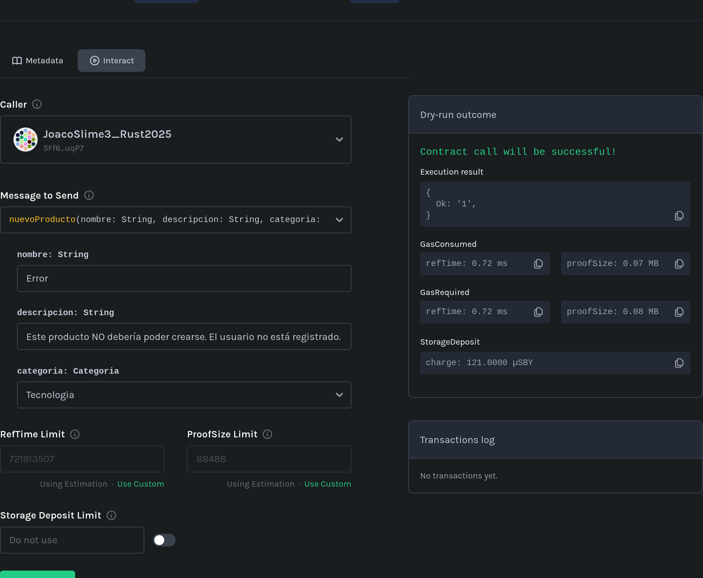
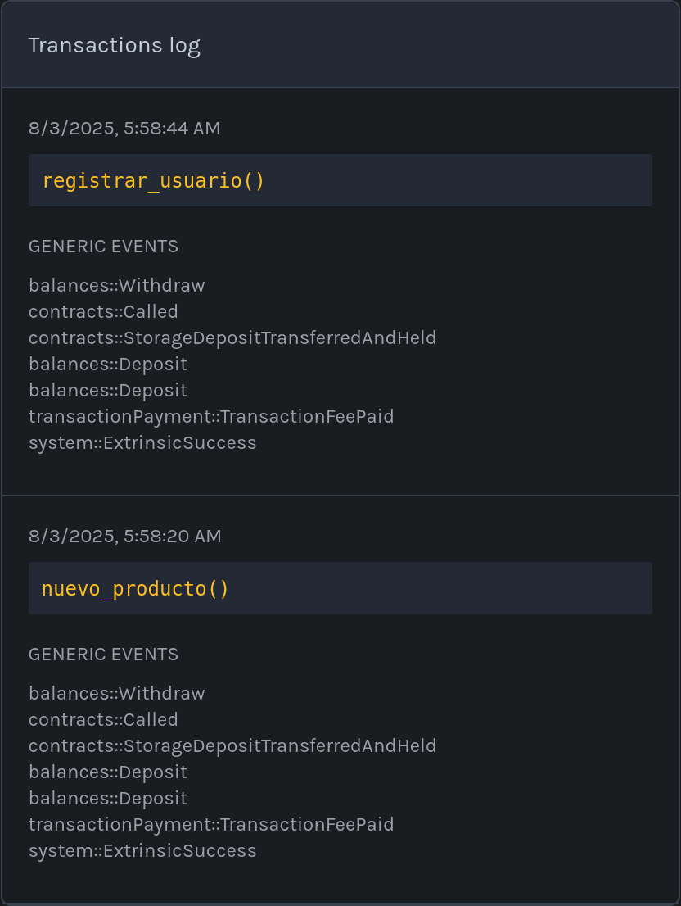
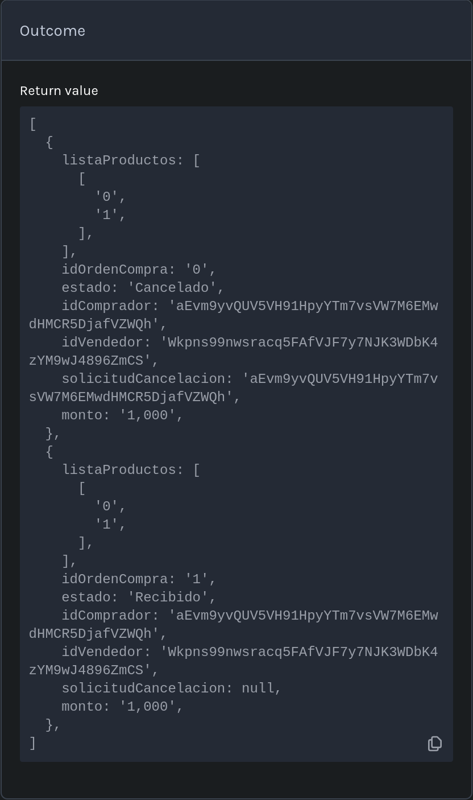
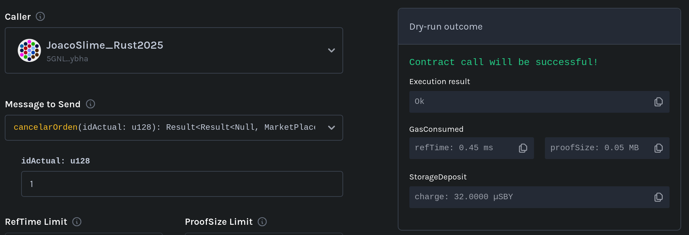
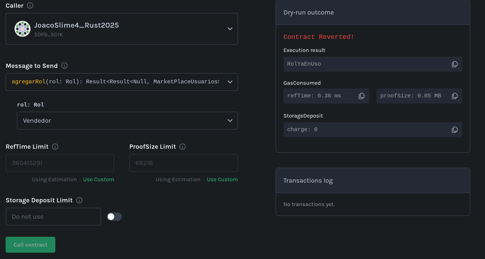
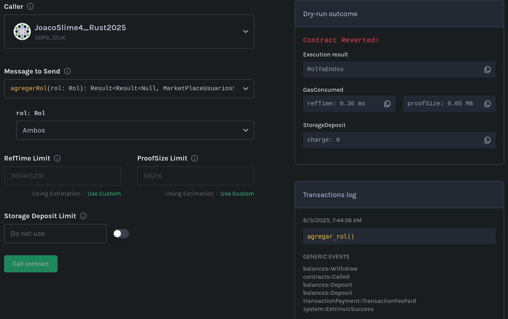
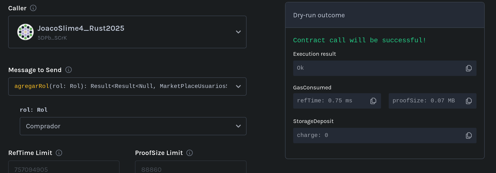

# Checklist de Corrección y QA – Primera Entrega TP Final: Marketplace Descentralizado

**Materia:** Seminario de Lenguajes – Opción Rust
**Entrega:** Primera entrega obligatoria (18 de julio)
**Cobertura de tests requerida:** ≥ 85%

---

## 1. Requisitos funcionales obligatorios

### Registro y gestión de usuarios
- [x] Permite registrar usuarios con rol `Comprador`, `Vendedor` o ambos.
- [x] Permite modificar roles de usuario luego del registro.

### Publicación de productos
- [x] Solo los usuarios con rol `Vendedor` pueden publicar productos.
- [x] El producto incluye nombre, descripción, precio, cantidad y categoría.
- [x] El usuario puede visualizar sus propios productos publicados.

### Compra y gestión de órdenes
- [x] Solo usuarios con rol `Comprador` pueden crear órdenes de compra.
- [x] Al comprar, se crea la orden y se descuenta el stock correctamente.
- [x] La orden puede tener estado: `pendiente`, `enviado`, `recibido`.
- [x] Solo el `Vendedor` puede marcar la orden como `enviado`.
- [x] Solo el `Comprador` puede marcar la orden como `recibido`.
- [ ] Las validaciones de permisos y estados se aplican correctamente.

---

## 2. Contrato desplegado en testnet

- [x] Se incluye la dirección (`address`) del contrato desplegado en **Shibuya Testnet**.
- [x] El contrato desplegado en testnet es **funcional** y permite interactuar con todas las funcionalidades requeridas.

---

## 3. Testing y calidad del código

- [x] Existe una suite de tests automatizados que cubre **≥ 85%** del código del contrato.
- [x] El código está bien estructurado y comentado según lo visto en clase.
- [x] Incluye documentación técnica clara para las funcionalidades implementadas.

#### Set mínimo de pruebas obligatorio:
- [ ] Test de registro de usuario con cada rol posible.
- [x] Test de publicación de producto.
- [x] Test de compra de producto y generación de orden.
- [x] Test de cambio de estado de la orden (`pendiente` → `enviado` → `recibido`).
- [x] Test de validación de permisos (solo quien corresponde puede ejecutar cada acción).
- [ ] Test de errores esperados (ej: intentar comprar sin stock, cambiar estado sin permisos, etc.).

---

## 4. Checklist QA – Verificación manual en Testnet (Shibuya)

**Antes de aprobar la entrega, probar en la testnet lo siguiente:**

### Registro y roles
- [x] Registrar un usuario nuevo como `Comprador` y verificar que se guarde correctamente.
- [x] Registrar un usuario nuevo como `Vendedor` y verificar que se guarde correctamente.
- [x] Registrar un usuario con ambos roles.
- [x] Cambiar el rol de un usuario y chequear que el cambio se refleje en el contrato.

### Publicación de productos
- [x] Como `Vendedor`, publicar al menos un producto con todos los datos requeridos.
- [x] Verificar que el producto figure en la lista de productos del vendedor.

### Compra y órdenes
- [x] Como `Comprador`, realizar la compra de un producto disponible.
- [x] Chequear que se descuente correctamente el stock tras la compra.
- [x] Verificar que la orden queda en estado `pendiente`.
- [x] Como `Vendedor`, cambiar el estado de la orden a `enviado`.
- [x] Como `Comprador`, cambiar el estado de la orden a `recibido`.

### Validaciones y errores esperados
- [x] Intentar comprar un producto sin stock y verificar que el contrato rechaza la operación.
- [x] Intentar que alguien que no sea el vendedor cambie el estado a `enviado` (debe fallar).
- [x] Intentar que alguien que no sea el comprador cambie el estado a `recibido` (debe fallar).
- [x] Intentar publicar un producto sin ser `Vendedor` (debe fallar).

### General
- [x] Confirmar que los cambios de estado y acciones se reflejan correctamente en el almacenamiento y pueden ser consultados vía RPC.

**En caso de detectar algún fallo o comportamiento incorrecto, dejar evidencia** (logs, capturas o referencias a transacciones) que ilustre el problema.

---

## 5. Observaciones y comentarios

> Anotar aquí cualquier observación relevante (errores encontrados, código confuso, validaciones ausentes, recomendaciones, etc.)
- La documentación está completa y correcta. Sin embargo, presenta algunos errores ortográficos y de estilización, además de poseer ejemplos de uso que no pasan los tests.
- Un usuario que no esté registrado puede crear productos. Esto se debe a que `nuevo_producto()` solo detiene su ejecución si `es_vendedor()` devuelve un resultado de `Ok(false)`, si el usuario no existe devuelve `Err(ErrorSistema::UsuarioNoExiste)` y al no concordar, la ejecución continua. Aún así, un usuario no registrado no es capaz de publicar un producto, pero debería ser un caso considerado.  
- Aunque el vendedor *puede* hace una "Visualización de productos propios" a través de `get_publicaciones()`, en realidad, debería ser una funcionalidad aparte que permita al vendedor ver **solo** sus propias publicaciones, no todas las disponibles.
- `_generar_orden_compra()` posee un comentario donde indica verificar si existe al menos una compra en la orden de compra, la cual no está presente.
- Un usuario tercero, el cual no sea el vendedor o el comprador, puede solicitar la cancelación de una orden. Esto causa que se viole el requerimiento de consentimiento mutuo.
- Se puede solicitar (y aceptar) la cancelación de una orden de compra a pesar de que el estado de la orden ya esté marcada como "Recibida".  
- No se incluyen tests suficientes de registro de usuarios, debe de poseer al menos un test por cada rol.
- Los tests deberían cada uno probar un solo caso particular y ser independientes de cada uno. Por ejemplo, `test_agregar_rol()` prueba 4 casos distintos, los cuales podrían ser descompuestos en, `test_agregar_roles_a_comprador()` (donde se pruebe agregar los 3 posibles roles a un usuario comprador), `test_agregar_roles_a_vendedor()`, `test_agregar_roles_a_ambos()` y `test_agregar_roles_a_usuario_inexistente()`, que harían un trabajo similar al primero. Por otro lado, se debería abusar menos de las funciones para llegar a estados previos al test, como es el caso de `test_marcar_orden_como_recibida()`: la cual, en vez de crear una estructura predeterminada para `sistema`, posee varias lineas de inicialización de datos previas a la propia prueba que se quiere realizar.
- Aunque posee casos de test donde se se crean publicaciones correctamente (`test_publicacion_tiene_stock()`), debería haber un caso de test independiente que compruebe que esto suceda.
- Aunque se poseen casos de prueba donde se intenta validar los permisos del usuario, estos son insuficientes y son dependientes de otros casos de testeo.
- Existe una falla en la lógica que hace posible eliminarse roles al usar la función `agregarRol()` teniendo ya el rol de `Ambos`. Permitiendo, por ejemplo, cambiar del rol `Comprador` a `Ambos`, para posteriormente pasar a tener únicamente el rol `Vendedor`.    
- En la gran mayoría de casos, los test no verifican el estado final del sistema. Por ejemplo, verifica que al intentar marcar una orden como enviada se generen los errores correspondientes en los debidos momentos, pero no verifica que si no hay errores el estado de la orden de compra haya efectivamente cambiado.

---

**Resultado general:**
- [ ] APROBADO
- [x] DESAPROBADO

---
