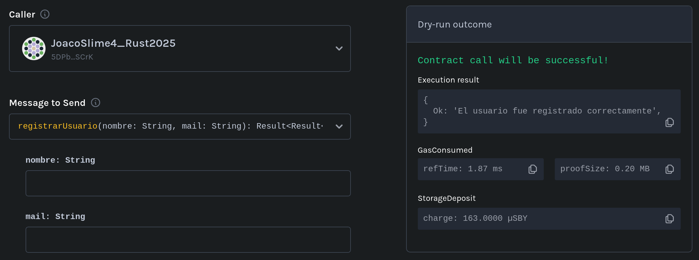
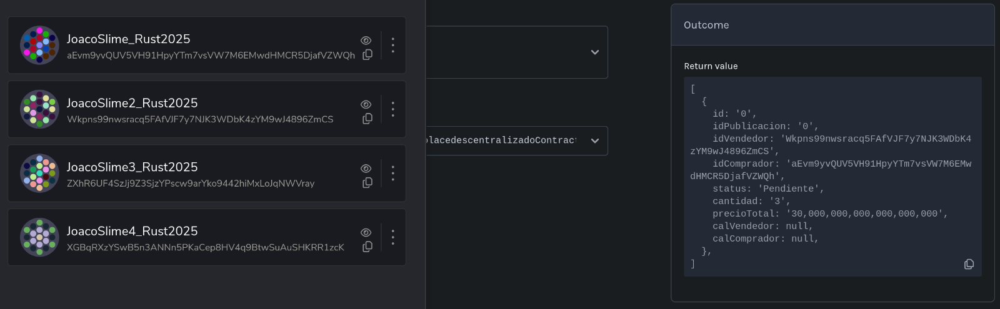
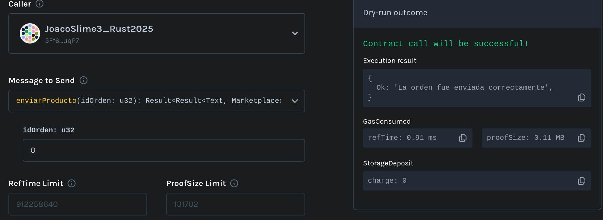

# Checklist de Corrección y QA – Primera Entrega TP Final: Marketplace Descentralizado

**Materia:** Seminario de Lenguajes – Opción Rust
**Entrega:** Primera entrega obligatoria (18 de julio)
**Cobertura de tests requerida:** ≥ 85%

---

## 1. Requisitos funcionales obligatorios

### Registro y gestión de usuarios
- [ ] Permite registrar usuarios con rol `Comprador`, `Vendedor` o ambos.
- [x] Permite modificar roles de usuario luego del registro.

### Publicación de productos
- [x] Solo los usuarios con rol `Vendedor` pueden publicar productos.
- [x] El producto incluye nombre, descripción, precio, cantidad y categoría.
- [x] El usuario puede visualizar sus propios productos publicados.

### Compra y gestión de órdenes
- [x] Solo usuarios con rol `Comprador` pueden crear órdenes de compra.
- [x] Al comprar, se crea la orden y se descuenta el stock correctamente.
- [x] La orden puede tener estado: `pendiente`, `enviado`, `recibido`.
- [ ] Solo el `Vendedor` puede marcar la orden como `enviado`.
- [ ] Solo el `Comprador` puede marcar la orden como `recibido`.
- [x] Las validaciones de permisos y estados se aplican correctamente.

---

## 2. Contrato desplegado en testnet

- [x] Se incluye la dirección (`address`) del contrato desplegado en **Shibuya Testnet**.
- [x] El contrato desplegado en testnet es **funcional** y permite interactuar con todas las funcionalidades requeridas.

---

## 3. Testing y calidad del código

- [x] Existe una suite de tests automatizados que cubre **≥ 85%** del código del contrato.
- [x] El código está bien estructurado y comentado según lo visto en clase.
- [ ] Incluye documentación técnica clara para las funcionalidades implementadas.

#### Set mínimo de pruebas obligatorio:
- [ ] Test de registro de usuario con cada rol posible.
- [ ] Test de publicación de producto.
- [x] Test de compra de producto y generación de orden.
- [x] Test de cambio de estado de la orden (`pendiente` → `enviado` → `recibido`).
- [ ] Test de validación de permisos (solo quien corresponde puede ejecutar cada acción).
- [x] Test de errores esperados (ej: intentar comprar sin stock, cambiar estado sin permisos, etc.).

---

## 4. Checklist QA – Verificación manual en Testnet (Shibuya)

**Antes de aprobar la entrega, probar en la testnet lo siguiente:**

### Registro y roles
- [ ] Registrar un usuario nuevo como `Comprador` y verificar que se guarde correctamente.
- [ ] Registrar un usuario nuevo como `Vendedor` y verificar que se guarde correctamente.
- [ ] Registrar un usuario con ambos roles.
- [x] Cambiar el rol de un usuario y chequear que el cambio se refleje en el contrato.

### Publicación de productos
- [x] Como `Vendedor`, publicar al menos un producto con todos los datos requeridos.
- [ ] Verificar que el producto figure en la lista de productos del vendedor.

### Compra y órdenes
- [x] Como `Comprador`, realizar la compra de un producto disponible.
- [x] Chequear que se descuente correctamente el stock tras la compra.
- [x] Verificar que la orden queda en estado `pendiente`.
- [x] Como `Vendedor`, cambiar el estado de la orden a `enviado`.
- [x] Como `Comprador`, cambiar el estado de la orden a `recibido`.

### Validaciones y errores esperados
- [x] Intentar comprar un producto sin stock y verificar que el contrato rechaza la operación.
- [ ] Intentar que alguien que no sea el vendedor cambie el estado a `enviado` (debe fallar).
- [ ] Intentar que alguien que no sea el comprador cambie el estado a `recibido` (debe fallar).
- [x] Intentar publicar un producto sin ser `Vendedor` (debe fallar).

### General
- [x] Confirmar que los cambios de estado y acciones se reflejan correctamente en el almacenamiento y pueden ser consultados vía RPC.

**En caso de detectar algún fallo o comportamiento incorrecto, dejar evidencia** (logs, capturas o referencias a transacciones) que ilustre el problema.

---

## 5. Observaciones y comentarios

> Anotar aquí cualquier observación relevante (errores encontrados, código confuso, validaciones ausentes, recomendaciones, etc.)

- Actualmente se debe registrar primero el usuario sin roles y luego se les añaden roles. La manera correcta sería que los usuarios se registren con al menos ya un rol elegido, sea este `Comprador`, `Vendedor` o ambos. Además, se deben agregar los tests para estos casos. Como dato extra, los usuarios pueden registrase sin ingresar ningún dato. 
- Aunque el vendedor *puede* hacer una "Visualización de productos propios" a través de `listar_publicaciones()`, en realidad, debería ser una funcionalidad aparte que permita al vendedor ver **solo** sus propias publicaciones, no todas las disponibles.
- La documentación es incompleta e incoherente. Posee descripciones técnicas de lo que realizan las funciones, sin embargo, estas descripciones no documentan lo que las funciones realizan realmente. Tal es el caso de `get_precio_unitario()`, por ejemplo, el cual su documentación indica que devuelve el stock de la publicación.
- Sería preferible que al crear una publicación, una orden de compra o un producto, se retornada la id de este.
- El test `test_crear_producto_falla_si_es_comprador()` no prueba que la creación falle con un comprador, falla debido a que `registrar_comprador()` no establece el rol de comprador al usuario creado.
- Existen algunos fallos ortográficos o gramaticales, como es el caso de `test_crear_producto_falla_si_ya_esxiste()`.
- El stock puede establecerse al crear el producto (A pesar de que no haya vendedores que provean tal producto).
- La implementación de `recibir_producto()` y `enviar_producto()` permiten a *cualquier* comprador y vendedor, respectivamente, realizar el cambio de estado de la orden.  
- Sería mejor utilizar, en los tests, los datos esperados como resultado en vez de checkear datos en específicos luego de obtener el resultado. Similar a como se mostró la utilización de `assert_eq!(esperado,resultado);`.
- Test de publicación de productos: No posee tests que verifique que no sea posible crear publicaciones (ni productos) con stock o precio `0`, o nombre o descripción vacíos.

---

**Resultado general:**
- [ ] APROBADO
- [x] DESAPROBADO

---
