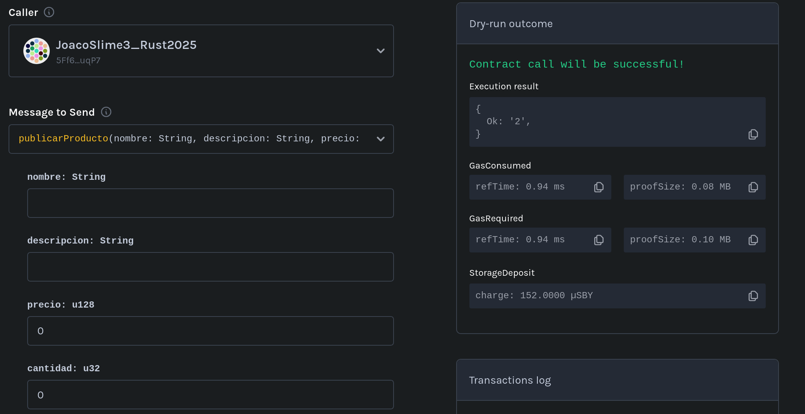

# Checklist de Corrección y QA – Primera Entrega TP Final: Marketplace Descentralizado

**Materia:** Seminario de Lenguajes – Opción Rust
**Entrega:** Primera entrega obligatoria (18 de julio)
**Cobertura de tests requerida:** ≥ 85%

---

## 1. Requisitos funcionales obligatorios

### Registro y gestión de usuarios
- [x] Permite registrar usuarios con rol `Comprador`, `Vendedor` o ambos.
- [x] Permite modificar roles de usuario luego del registro.

### Publicación de productos
- [x] Solo los usuarios con rol `Vendedor` pueden publicar productos.
- [x] El producto incluye nombre, descripción, precio, cantidad y categoría.
- [x] El usuario puede visualizar sus propios productos publicados.

### Compra y gestión de órdenes
- [x] Solo usuarios con rol `Comprador` pueden crear órdenes de compra.
- [x] Al comprar, se crea la orden y se descuenta el stock correctamente.
- [x] La orden puede tener estado: `pendiente`, `enviado`, `recibido`.
- [x] Solo el `Vendedor` puede marcar la orden como `enviado`.
- [x] Solo el `Comprador` puede marcar la orden como `recibido`.
- [x] Las validaciones de permisos y estados se aplican correctamente.

---

## 2. Contrato desplegado en testnet

- [x] Se incluye la dirección (`address`) del contrato desplegado en **Shibuya Testnet**.
- [x] El contrato desplegado en testnet es **funcional** y permite interactuar con todas las funcionalidades requeridas.

---

## 3. Testing y calidad del código

- [x] Existe una suite de tests automatizados que cubre **≥ 85%** del código del contrato.
- [ ] El código está bien estructurado y comentado según lo visto en clase.
- [ ] Incluye documentación técnica clara para las funcionalidades implementadas.

#### Set mínimo de pruebas obligatorio:
- [ ] Test de registro de usuario con cada rol posible.
- [ ] Test de publicación de producto.
- [ ] Test de compra de producto y generación de orden.
- [ ] Test de cambio de estado de la orden (`pendiente` → `enviado` → `recibido`).
- [x] Test de validación de permisos (solo quien corresponde puede ejecutar cada acción).
- [x] Test de errores esperados (ej: intentar comprar sin stock, cambiar estado sin permisos, etc.).

---

## 4. Checklist QA – Verificación manual en Testnet (Shibuya)

**Antes de aprobar la entrega, probar en la testnet lo siguiente:**

### Registro y roles
- [x] Registrar un usuario nuevo como `Comprador` y verificar que se guarde correctamente.
- [x] Registrar un usuario nuevo como `Vendedor` y verificar que se guarde correctamente.
- [x] Registrar un usuario con ambos roles.
- [x] Cambiar el rol de un usuario y chequear que el cambio se refleje en el contrato.

### Publicación de productos
- [x] Como `Vendedor`, publicar al menos un producto con todos los datos requeridos.
- [x] Verificar que el producto figure en la lista de productos del vendedor.

### Compra y órdenes
- [x] Como `Comprador`, realizar la compra de un producto disponible.
- [x] Chequear que se descuente correctamente el stock tras la compra.
- [x] Verificar que la orden queda en estado `pendiente`.
- [x] Como `Vendedor`, cambiar el estado de la orden a `enviado`.
- [x] Como `Comprador`, cambiar el estado de la orden a `recibido`.

### Validaciones y errores esperados
- [x] Intentar comprar un producto sin stock y verificar que el contrato rechaza la operación.
- [x] Intentar que alguien que no sea el vendedor cambie el estado a `enviado` (debe fallar).
- [x] Intentar que alguien que no sea el comprador cambie el estado a `recibido` (debe fallar).
- [x] Intentar publicar un producto sin ser `Vendedor` (debe fallar).

### General
- [ ] Confirmar que los cambios de estado y acciones se reflejan correctamente en el almacenamiento y pueden ser consultados vía RPC.

**En caso de detectar algún fallo o comportamiento incorrecto, dejar evidencia** (logs, capturas o referencias a transacciones) que ilustre el problema.

---

## 5. Observaciones y comentarios

> Anotar aquí cualquier observación relevante (errores encontrados, código confuso, validaciones ausentes, recomendaciones, etc.)
- La documentación es insuficiente y la estructura del código es poco legible. Hay largas lineas de código y las estructuras de datos no poseen métodos para delegar responsabilidades.
- Al modificar los roles del usuario, no se verifica que este solo pueda agregarse roles y no quitarselos. Permite así pasar de `Ambos` o `Vendedor` a solamente `Comprador`, por ejemplo.
- El contrato permite que se cree una publicación con datos vacios y en 0.
- La cancelación de las ordenes está implementada correctamente.
- Resultan insuficientes los test de:
    - Registro de usuarios con distintos roles: Solo se posee para `Comprador`.
    - Test de publicación de productos: No posee tests que verifique que no sea posible crear publicaciones con cantidad o precio `0`, o nombre, descripción, o categoría vacíos. 
    - Test de creación de orden: No posee tests que verifiquen que no sea posible crear ordenes de compra con stock `0`.
    - Test de cambio de estado de la orden: No posee tests que verifiquen que el producto no pueda pasar directamente a `recibido`, ni test que verifiquen que no es posible retroceder a `pendiente` o `enviado` cuando el estado es `recibido`.
- El estado de las ordenes no puede ser consultado mediante RPC, no se poseen metodos para realizar esta acción.

---

**Resultado general:**
- [ ] APROBADO
- [x] DESAPROBADO

---
